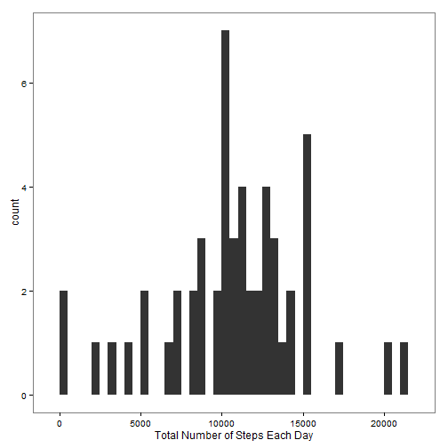
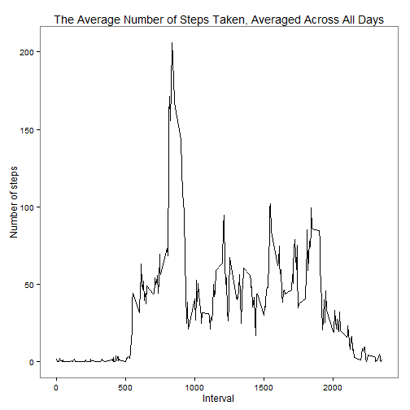
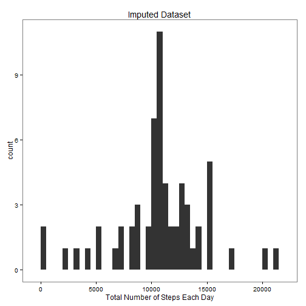
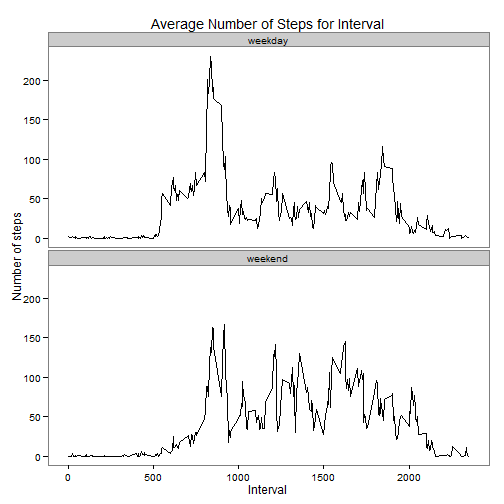

# Reproducible Research: Peer Assessment 1


## Loading and preprocessing the data

```r
# set options of scipen=6 so scientific notation is not used below.
options(scipen=6)

# read data
act <- read.csv("./activity/activity.csv", 
                colClasses=c("numeric", "character", "numeric"))

# convert date to class date
act$date <- as.Date(act$date, "%Y-%m-%d")

# view structure
str(act)
```

```
## 'data.frame':	17568 obs. of  3 variables:
##  $ steps   : num  NA NA NA NA NA NA NA NA NA NA ...
##  $ date    : Date, format: "2012-10-01" "2012-10-01" ...
##  $ interval: num  0 5 10 15 20 25 30 35 40 45 ...
```


## What is mean total number of steps taken per day?

```r
# calculate sum of steps taken per day
tot.steps <- aggregate(steps ~ date, sum, data=act)

# calculate mean and median total number of steps per day
mean.tot.steps <- round(mean(tot.steps$steps))
median.tot.steps <- round(median(tot.steps$steps))
```

Histogram of the total number of steps taken each day. 


```r
library(ggplot2)
qplot(tot.steps$steps, binwidth=500) +
    theme_bw() + 
    theme(panel.grid.major=element_blank(), panel.grid.minor=element_blank()) +
    xlab("Total Number of Steps Each Day")
```

 

The mean total number of steps taken per day was 10766 and the 
median was 10765.

## What is the average daily activity pattern?

```r
# calculating the average daily activity per 5 minute interval
#  ignoring NAs
fivemin.steps <- aggregate(steps ~ interval, mean, data=act)

# plot
ggplot(data=fivemin.steps, aes(x=interval, y=steps)) +
    theme_bw() + 
    theme(panel.grid.major=element_blank(), panel.grid.minor=element_blank()) +
    geom_line() +
    xlab("Interval") +
    ylab("Number of steps") +
    ggtitle("The Average Number of Steps Taken, Averaged Across All Days")
```

 

```r
# calculate the interval with the maximum number of steps
fivemin.steps.max <- subset(fivemin.steps, steps==max(fivemin.steps$steps))
```

The 5-minute interval, 835, contained the maximum number of
steps averaged across all the days in the dataset ignoring NAs.
The maximum was 206.1698.

## Imputing missing values


```r
# substitute missing values with the average for the 5 minute interval across days
#  the floor function was used on the average for a 5 min interval 
#  since steps should be an integer

# create new dataset per instruction
act.impNA <- act[2:3]
act.impNA$steps <- ifelse(is.na(act$steps), 
                          floor(fivemin.steps$steps), act$steps)

# calculate sum of steps taken per day
tot.steps <- aggregate(steps ~ date, sum, data=act.impNA)

# calculate mean and median total number of steps per day
mean.tot.steps.noNA <- round(mean(tot.steps$steps))
median.tot.steps.noNA <- round(median(tot.steps$steps))
```

Histogram of the total number of steps taken each day. 


```r
qplot(tot.steps$steps, binwidth=500) +
    theme_bw() + 
    theme(panel.grid.major=element_blank(), panel.grid.minor=element_blank()) +
    xlab("Total Number of Steps Each Day") +
    ggtitle("Imputed Dataset")
```

 

The mean total number of steps taken per day using the imputed dataset was 
10750 and the median was 10641.  For the 
original data, the mean and median were 10766 and 
10765 respectively.

**Effect of imputing data**  
The mean and median for the imputed data are less than the values for the 
original data.  This is likely a result of imputing the majority of the NAs 
with zeroes.


## Are there differences in activity patterns between weekdays and weekends?


```r
# use imputed data and create a weekend and weekday factor
act.impNA$day <- weekdays(act.impNA$date)
act.impNA$ww <- factor(ifelse(act.impNA$day=="Saturday"|
                              act.impNA$day=="Sunday", 
                              "weekend", "weekday"))

fivemin.steps.ww <- aggregate(steps ~ interval + ww, mean, data=act.impNA)

# plot data
ggplot(data=fivemin.steps.ww, aes(x=interval, y=steps)) +
    theme_bw() + 
    theme(panel.grid.major=element_blank(), panel.grid.minor=element_blank()) +
    geom_line() +
    facet_wrap(~ ww, ncol=1) +
    xlab("Interval") +
    ylab("Number of steps") +
    ggtitle("Average Number of Steps for Interval")
```

 

